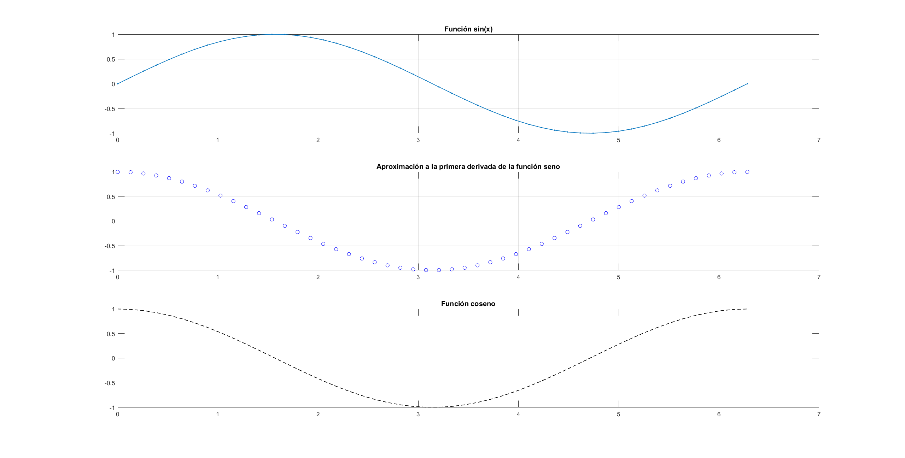

# Heat Transfer Simulation and Derivation in Fortran

This repository contains Fortran implementations for simulating heat transfer on a 2D metal plate and calculating derivatives. Visualization of the results is done using MATLAB.

## Heat Transfer Simulation

The Fortran code simulates heat transfer on a 2D metal plate, illustrating how heat propagates over time. The simulation results have been captured and are visualized in the GIF below:

Simulation_heat_2D\figures\heat_simulation.gif

## Derivative Calculation

The Fortran code also includes a derivative calculation. Below is a graph showing a sinusoidal function and its calculated derivative, which resembles the cosine function:

## Repository Structure

- `/Simulation_heat_2d`: Contains Fortran code for simulating heat transfer.
- `/Derivative`: Contains Fortran code for derivative calculation and MATLAB scripts for visualizing simulation results

Feel free to explore the code and experiment with the simulations and derivative calculations.

---

Enjoy exploring the heat transfer simulation and derivative calculation in Fortran!

